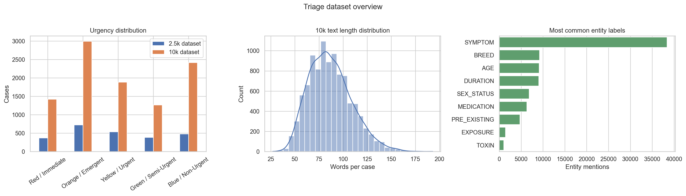
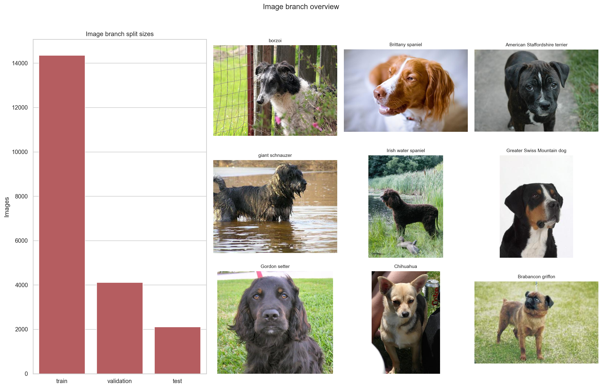
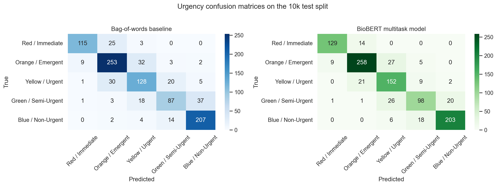
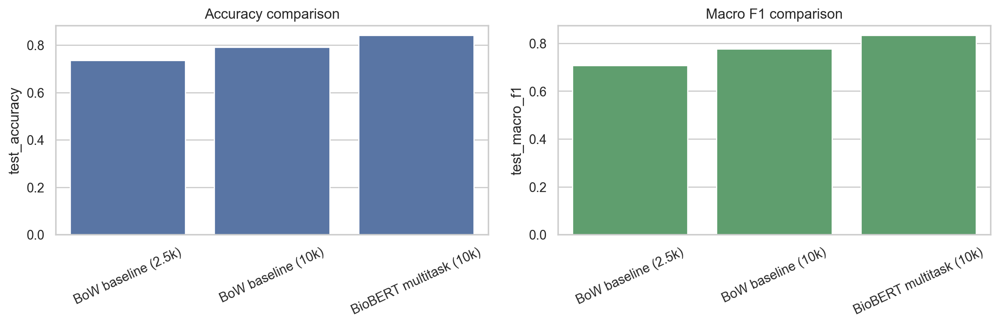
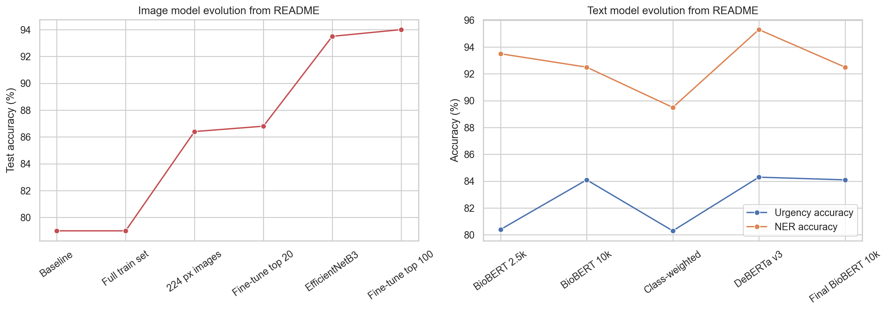

# Pet Triage Executive Summary

## Overview

This project addresses a practical veterinary operations problem: pet owners often describe urgent symptoms in inconsistent, emotional, and incomplete language, while clinics must still decide which cases need immediate attention. Our goal was to build a decision-support system that can read a pet owner's free-text description, predict urgency on a five-level triage scale, extract clinically useful entities such as symptoms and medications, and, when an image is provided, identify the dog's breed. The final system is designed as a multimodal demo rather than a fully autonomous medical tool. It is meant to support triage workflow, not replace clinical judgment.

The repository shows a clear progression from simple baselines to a stronger final architecture. Early work focused on text-only urgency classification using bag-of-words and embedding models. Those baselines were useful because they were fast to train and easy to explain, but they relied heavily on surface words and did not explicitly model clinical structure. The final version upgraded the text branch to a BioBERT-based multitask model that predicts urgency and performs named-entity recognition at the same time. In parallel, the image branch uses an EfficientNetB3 classifier to predict dog breed from a photo. The deployed Streamlit app combines both outputs and presents urgency, extracted entities, and breed prediction together.

## Data and System Design

The project uses two main data assets. The text side contains a smaller pilot dataset with 2,499 synthetic triage cases and a larger final dataset with 9,984 synthetic cases. Each case includes a free-text message, a five-level urgency label, and structured entities such as age, breed, medication, duration, and symptoms. The image side contains 120 dog breeds split into 14,355 training images, 4,115 validation images, and 2,110 test images. This structure supported a final architecture with two independent models that run in parallel inside the app.

The text branch is the most important modeling contribution in the repository. In the final implementation, `nlp_gpu.py` loads the `dmis-lab/biobert-base-cased-v1.2` backbone and adds two heads: one for urgency classification and one for BIO-tagged token classification. This design matters because the two tasks reinforce each other. Learning to tag symptom phrases, medications, and durations helps the model focus on clinically relevant spans, while urgency supervision encourages the model to attend to the combinations of findings that matter most for triage. The image branch in `image_processing_gpu.py` uses EfficientNetB3 pretrained on ImageNet and fine-tuned for 120-breed classification. The final app in `app_gpu.py` is also architecturally cleaner than the older fusion prototype because it decouples the image and text branches, making the system easier to explain and maintain.

## Results

The descriptive analysis in the companion notebook shows that the larger 10k triage dataset is meaningfully diverse in both urgency mix and entity composition. It also confirms that the image branch has balanced coverage across all 120 breeds and all three data splits. On the text side, a simple bag-of-words baseline trained on the 2.5k dataset achieved 73.6% test accuracy with a macro F1 of 0.708. Training the same lexical baseline on the larger 10k dataset improved performance to 79.1% accuracy and 0.777 macro F1. That gain is important because it shows the project benefited not only from a better model, but also from scaling the training set.

The final BioBERT multitask checkpoint achieved 84.1% test accuracy, 0.833 macro F1, and 0.841 weighted F1 on the held-out 10k test split reproduced in the notebook. That is roughly a five-point accuracy gain over the 10k bag-of-words baseline and about a ten-point gain over the smaller 2.5k baseline. The final model also reached 92.5% token-level NER accuracy, which means the system can do more than rank urgency: it can surface the specific clinical details that influenced the decision. This interpretability matters in a veterinary setting because it makes the model easier to audit and easier to present to instructors, teammates, and potential users.

The image branch also produced strong final numbers. According to the repository README and training notes, the EfficientNetB3 pipeline improved from a 79% baseline to 94.0% test accuracy after moving to larger 300x300 inputs, adopting the B3 backbone, and carefully fine-tuning the top layers. Taken together, the final system demonstrates that the strongest predictive improvement came from the BioBERT text upgrade, while the image branch matured into a reliable breed classifier that complements the text analysis.

## Business Value and Implementation Fit

From a business and workflow perspective, the project has a credible use case as a triage support tool for veterinary front desks, tele-triage intake, or after-hours screening. The urgency classifier can help staff sort incoming messages faster, while the NER output makes the recommendation easier to justify by explicitly listing symptoms, medications, durations, and prior conditions. Breed prediction adds user-facing completeness and may help contextualize communication in the app, even though breed alone should not drive triage urgency. The system is especially promising as a queue-prioritization assistant rather than a stand-alone diagnostic engine.

The implementation path should center on decision support. The current codebase is already close to that framing because the app surfaces model outputs rather than hiding them. A practical deployment would store clinician overrides, capture calibration data, monitor disagreement between staff and model predictions, and maintain separate versioning for the text and image branches. The modular structure in `app_gpu.py` supports this path better than the earlier fusion-only design.

## Risks and Next Steps

The main limitation is data provenance. The triage text data is synthetic, which means performance on real clinic messages may be lower because real owners write less cleanly, provide less complete context, and may describe multiple problems at once. The original fusion prototype also should not be overclaimed: `MultimodalFusionLayer.py` pairs text and image data in a demonstration-friendly way, but not as a clinically validated paired multimodal dataset. In addition, the urgency outputs are not calibrated for direct medical decision making, and the image model predicts breed rather than visible injury severity. For those reasons, the strongest defensible claim is that the project delivers a strong proof of concept for triage prioritization and entity extraction, not a deployable autonomous clinical system.

The clearest next steps are to validate the text model on real intake notes, collect truly paired image-text triage cases, calibrate urgency probabilities, and extend the image branch beyond breed recognition toward direct symptom cues such as posture, swelling, wounds, or visible distress. Even with those limitations, the current project demonstrates a meaningful end-to-end machine learning workflow: problem framing, baseline modeling, architecture improvement, evaluation, and user-facing integration.

\newpage

## Figures Appendix

### Figure A. Descriptive analysis overview

### Figure B. Image branch overview

### Figure C. Baseline versus BioBERT confusion matrices

### Figure D. Metric comparison across model stages

### Figure E. Reported model evolution from the repository

\newpage

## References and AI-Tool Disclosure

Project files:

- `README.md`
- `embedding.py`
- `text_models_bow_and_embedding.py`
- `MultimodalFusionLayer.py`
- `image_processing_gpu.py`
- `nlp_gpu.py`
- `app.py`
- `app_gpu.py`
- `triage_dataset_2500_clean.jsonl`
- `triage_dataset_10k_clean.jsonl`

External references:

- Lee, J., Yoon, W., Kim, S., Kim, D., Kim, S., So, C. H., and Kang, J. (2020). *BioBERT: a pre-trained biomedical language representation model for biomedical text mining*. Bioinformatics, 36(4), 1234-1240.
- Tan, M., and Le, Q. (2019). *EfficientNet: Rethinking model scaling for convolutional neural networks*. Proceedings of ICML 2019.
- Hugging Face model used in code: `dmis-lab/biobert-base-cased-v1.2`.

AI-tool disclosure:

- OpenAI Codex (GPT-5-based coding assistant) was used on March 20, 2026 to help scaffold the notebook, generate report figures, and draft this executive summary. All content was manually reviewed and edited.
- The repository README states that the synthetic triage dataset was generated with a two-agent Gemini pipeline (writer plus annotator). That disclosure is relevant because it affects training data provenance.
